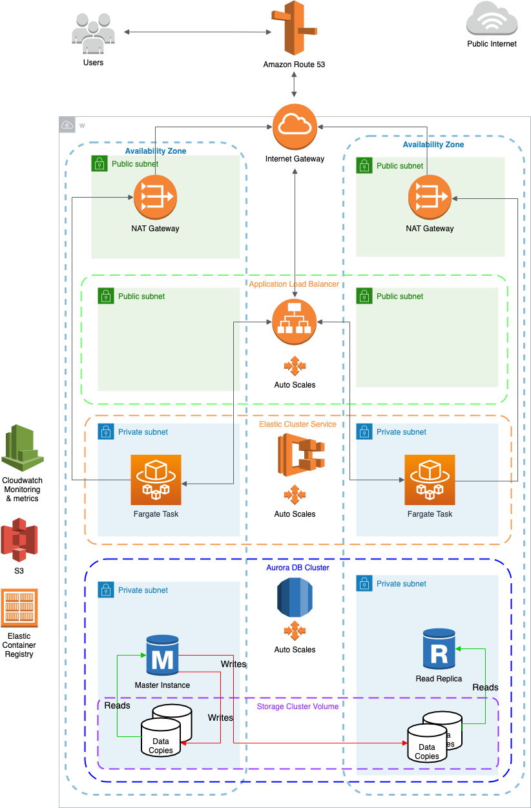
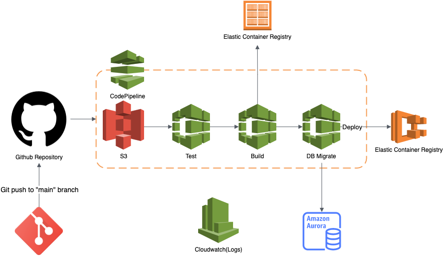

# Notejam app on AWS
## Basic info
Dev environment is set up and running on aws: http://dev.notejam.caner.cloud

Source code: https://github.com/DerinMavi/notejam

Folder structure:

- `app/` => Slightly modified Notejam app(uses mysql)
- `cicd/` => CI/CD related files:
- `infrastructure/` => Terraform files & configurations
- `docs/` => Architecture diagrams

## Setup

### Requirements:
- terraform
- aws cli & user with necessary IAM policy set up for provisioning
- Configure aws profile by running `aws configure`, (if you change the profile modify `infrastructure/main.auto.tfvars`)
- Fill `auto.tfvars` files under the `infrastructure` folder with desired values
- github does not support CodeStar Connections. After provisioning, Github connection need to be 
- manually approved from aws console -> CodePipeline -> Connections -> github-connection 
(see https://github.com/hashicorp/terraform-provider-aws/issues/15453 for details)

### Provision
    
1. `cd infrastructure/`
2. `terraform workspace new <workspace>`  (this is used to select the environment, supported `dev`, `test`, `prod`)
3. `terraform init`
4. `terraform apply`

## Architecture

The solution is provisioned on AWS using terraform. 

## CI/CD

CI/CD pipeline is set up using AWS CodePipeline and Github as source repository. It is 
triggered by commits in the main branch(configurable)

## Discussion of architecture

- IaC
  - Terraform is used 
  - Selected infrastructure settings are configurable via terraform variables (See `*.auto.tfvars` files in
        `infrastructure/`).
  - Allows customization per environment
  - Default settings for quickly provisioning 3 environments provided 
  - Sensitive information is stored in SSM Parameter store as SecureString
  - 

- ECS
  - Application is running in a containerized environment on AWS ECS as Fargate Task
  - Auto scaling configured (CPU metric)
  - Only one port is exposed, only to ALB
  - Private subnet provides additional security in case a public subnet is exposed to hackers
  - One way connection to internet using NAT gateway
  - serverless design, removes overhead of scaling, patching, securing, and managing servers
  - Log / Monitor application with CloudWatch

- NAT Gateway
  - instances in a private subnet can connect to services outside VPC 
  - external services cannot initiate a connection with the instances
  - Having a NAT Gateway in each AZ ensures high availability(If there is a single NAT Gateway and that AZ should 
  fail, then all private instances would lose Internet access)
  - A NAT Gateway is redundant within a single AZ

- Network setup
  - one VPC per environment
  - two subnets (different AZ) for every service (ecs, rds, lb, nat etc.)
  - all services are in private subnets except public facing services (natgw and lb)
  - security groups are configured with principle of least privilege

- Application load balancer
  - Distributes incoming traffic across multiple targets
  - Spans multiple AZs
  - Exposes only needed ports to the public
  - scales as incoming traffic changes

- Database
  - Amazon Aurora DB cluster is being used
  - mysql engine
  - In private subnet, one port exposed only to ECS Fargate services
  - Autoscaling, both, of compute and storage configured
  - Backup configured with configurable retention period
  - Storage encryption enabled
  - Many benefits over Amazon RDS, some of are:
    - Performance: delivers five times the throughput of standard MySQL running on the
    same hardware
    - Replication: storage is separate from the instances, Aurora can replicate data to
    six storage nodes in Multi AZs to withstand the loss of an entire AZ
    - Backups: are continuous, incremental backups that do not affect database performance.
    
- DNS
  - Route53 is used for managing DNS names 
  - Public DNS zone configured: http://caner.cloud(redirects to dev)
  - Depending on the environment dns records (subdomains) are being created automatically e.g.
  http://dev.notejam.caner.cloud

- Logging And Monitoring
  - All services (ECS, RDS, CodePipeline, CodeBuild etc.) are pushing their logs to the 
centralized logging system (CloudWatch)
  - Performance and health monitoring can be done via Dashboards of each service (e.g. ECS, ALB, RDS etc.)
  - Autoscaling alarms are set up(based on CPU loads)
  - Based on (configurable) CPU load threshold values Fargate tasks are scaled up or down

    
- CI/CD Pipeline
  - AWS CodePipeline is used as a CI/CD tool.
  - CI/CD pipeline is configured to run automatically when there is a push event on Github
  - The branch and repo is configurable
  - Unit tests are run first
  - If successful then build
  - If successful then database migration
  - If successful then deployment to ECS (rolling update)
  - All build logs are pushed to CloudWatch

## Business Requirements
- _The Application must serve variable amount of traffic. Most users are active during business hours. During big events
and conferences the traffic could be 4 times more than typical_

  ✅ Scalability is achieved via ALB, ECS, Aurora DB Cluster

- _The Customer takes guarantee to preserve your notes up to 3 years and recover it if needed_

  ✅ Database backup is set up with configurable retention period

- _The Customer ensures continuity in service in case of data center failures_

  ✅ Highly available infrastructure spanning over multiple AZs

- _The Service must be capable of being migrated to any regions supported by the cloud provider in case of emergency_

  ✅ Migration is quick and easy with IaC and configurable parameters

- _The Customer is planning to have more than 100 developers to work in this project who want to roll out multiple 
deployments a day without interruption / downtime_

  ✅ CI/CD pipeline is set up using Github & AWS CodePipeline

- _The Customer wants to provision separated environments to support their development process for development, testing, 
production in the near future_

  ✅ Setting up separate environments easy using IaC and configurable parameters

- _The Customer wants to see relevant metrics and logs from the infrastructure for quality 
assurance and security purposes_

  ✅ Metrics and logs are set up in CloudWatch

## What could be improved?

- AWS Web Application Firewall can be used to protect against common web attacks
- More CloudWatch metrics and monitoring options can be added
- To provide secure access to instances located in the private and public subnets, bastion 
host could be provisioned
- SSL certificate and https protocol can be used
- Amazon CloudFront can be used to serve static assets
- Amazon ElastiCache can use to speed up dynamic database-driven websites by caching data and objects in RAM to reduce the 
number of times an external data source must be read
- CI/CD pipeline can be triggered by more specific events, such as new tag pushes etc.
